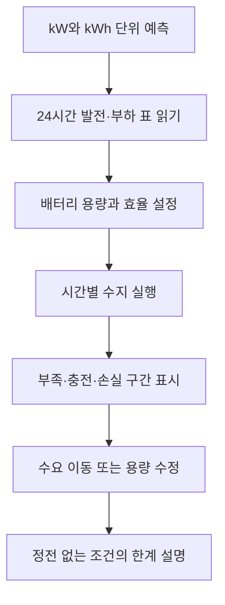

# 12. 정전 없는 섬

> 작성일: 2026-09-10 · 상태: 제작 전 설계 초안 v0.1
> 이 문서는 앱 구현, 이미지 생성, 커밋, 푸시, 배포를 승인하지 않습니다.
> 단일 버스의 시간별 에너지 수지로 단순화하며, 교류(AC) 조류 해석과 실제 설비 설계는 범위에 넣지 않는다.

> [전체 목록](README.md) · [공통 설계 기준](00-shared-design-principles.md)

## 1. 제품 목표

1. 시간별 발전량과 소비량의 단위를 kW와 kWh로 구분한다.
2. 남는 에너지가 배터리로 들어가고 부족할 때 나오는 과정을 계산한다.
3. 충전·방전 효율과 저장 손실이 정전 여부에 미치는 영향을 설명한다.
4. 수요를 시간 이동하거나 발전·배터리 용량을 바꾸며 조건을 비교한다.
5. 한 번의 성공 사례를 일반 해법으로 과장하지 않고 시간표 전체의 근거를 읽는다.

## 2. 대상과 선수 개념

- 권장 대상: 중학교 과학·수학 심화, 고등학교 통합과학·에너지 시스템 입문.
- 한 차시: 50분, 모둠별 섬 운영자 역할 권장.
- 선수 개념: 곱셈·단위 변환, 시간표, 비율, 평균과 최대값.
- 있으면 좋은 개념: 발전원, 저장, 수요 반응, 에너지 보존.
- 공식 성취기준 번호는 원문 확인 전까지 임의로 부여하지 않는다.

## 3. 핵심 용어와 단위

| 용어 | 앱에서의 정의 | 단위 |
|---|---|---|
| 전력 | 지금 낼 수 있거나 쓰는 비율 | kW |
| 전기에너지 | 일정 시간 동안 이동한 양 | kWh |
| 발전 전력 | 해당 시간 발전기가 낼 수 있는 비율 | kW |
| 부하 전력 | 해당 시간 섬이 요구하는 비율 | kW |
| 충전 에너지 | 한 시간 동안 배터리에 들어가는 양 | kWh |
| SOC | 배터리 저장 에너지 비율 | 0~1 |

1시간 간격에서는 `에너지 = 전력 × 1 h`이므로 수치가 같아 보일 수 있다.
그러나 15분 간격 후속에서는 `kW × 0.25 h = kWh`임을 화면에서 드러낸다.

## 4. 목표 오개념과 교정 단서

| 오개념 | 교정 단서 |
|---|---|
| 10 kW 발전기는 하루 10 kWh를 준다 | 시간 간격을 곱해 kWh로 바꾸게 한다 |
| 배터리는 넣은 만큼 모두 돌려준다 | 충전·방전 효율에 의한 손실 막대를 표시한다 |
| SOC 100%면 언제든 부하를 만족한다 | 방전 전력 제한과 시간별 부하를 함께 확인한다 |
| 충전과 방전은 동시에 하면 더 안전하다 | 한 시간 슬롯에는 한 방향만 허용한다 |
| 손실을 충전·방전에서 두 번 빼도 된다 | 단일 수지식과 손실 항목을 한 줄로 표시한다 |
| 평균 발전량이 평균 부하보다 크면 정전이 없다 | 시간별 부족 구간과 배터리 잔여량을 확인한다 |

## 5. 섬 시나리오

- 태양광: 낮에 높고 밤에 0인 24시간 발전 프로필.
- 바람: 밤에도 일부 발전하지만 시간별 변동이 있는 프로필.
- 부하: 냉장·담수화·주거·학교의 시간별 합계.
- 배터리: 에너지 용량 120 kWh, 충·방전 전력 한도 40 kW를 제안값으로 둔다.

## 6. 한 차시 흐름



## 7. 최소 구체 과제

### 과제 A: 전력과 에너지 카드 짝짓기

- 입력: “20 kW를 3시간”, “60 kWh 저장” 등 8개 카드.
- 조작: kW·kWh·시간 카드를 연결하고 변환식을 적는다.
- 판정: `kW × h = kWh`와 단위가 맞아야 통과한다.

### 과제 B: 한 시간 수지 예측

- 입력: 한 시간의 발전 전력, 부하 전력, SOC, 충·방전 한도.
- 조작: 충전·방전·부족 중 하나를 예측하고 예상 SOC를 입력한다.
- 판정: 방향이 맞고 단일 효율식 적용 결과와 오차 0.1 kWh 이내면 통과한다.
- 충전과 방전 동시 선택은 허용하지 않는다.

### 과제 C: 24시간 정전 없는 섬

- 입력: 24개 시간 슬롯, 태양광·바람·부하 프로필, 배터리 설정.
- 조작: 발전·배터리 용량과 수요 이동 카드를 변경하되, 이동 전후 총 kWh·허용 시간대·필수 부하를 보존한다.
- 출력: 시간별 수지표, SOC 곡선, 정전 여부, 손실 합계.
- 판정: 모든 시간의 미공급 에너지가 0이고 경계 조건을 위반하지 않아야 한다.

### 과제 D: 손실 설명

- 입력: 충전량·방전량·왕복효율 비교 두 시나리오.
- 조작: 손실이 발생한 시간과 원인을 선택한다.
- 판정: 효율 손실을 발전량에서 별도로 두 번 빼지 않고 배터리 수지에만 반영한다.

## 8. 시간별 모델과 경계 조건

기본 시간 간격은 `Δt = 1 h`이며, 모든 24개 슬롯은 같은 간격을 사용한다.

```text
P_gen(t), P_load(t): kW
E_gen(t) = P_gen(t) * Δt
E_load(t) = P_load(t) * Δt
net(t) = E_gen(t) - E_load(t)  // kWh
```

- `net > 0`: 부하를 먼저 공급한 뒤 남은 에너지를 충전한다.
- `net < 0`: 가능한 범위에서 방전하고 부족분을 계산한다.
- 한 슬롯은 충전 또는 방전 중 한 방향만 가진다.
- 충·방전 손실은 η 항으로 한 번만 반영한다.
- `E_bat`는 0 이상 `Emax` 이하의 kWh이고 `SOC = E_bat/Emax`인 무차원 비율이다.
- 배터리 전력 한도는 `Pmax × Δt`로 시간별 에너지 한도로 변환한다.
- 배터리 용량을 초과하는 남는 에너지는 버려진 에너지로 재할당한다.
- 배터리에서 꺼낼 수 없는 부족분은 `unservedEnergy`로 남긴다.

## 9. 배터리 수지식

제안 기본값: `ηc = 0.95`, `ηd = 0.95`, 시간당 자기방전율 `σ = 0.001`.

```text
E_after_self = E_bat(t) * (1 - σ)^Δt
E_charge = 0; discharge = 0; curtailed = 0; unservedEnergy = 0
if net >= 0:
  E_charge = min(net, Pmax*Δt, (Emax-E_after_self)/ηc)
  E_bat(t+1) = E_after_self + ηc*E_charge
  curtailed = net - E_charge
  discharge = 0
else:
  request = -net
  discharge = min(request, Pmax*Δt, E_after_self*ηd)
  E_bat(t+1) = E_after_self - discharge/ηd
  unservedEnergy = request - discharge
  E_charge = 0
```

- 방전량 `discharge`는 부하에 전달된 kWh로 정의한다.
- 배터리 내부에서 빠진 양은 `discharge / ηd`이며 같은 손실을 다시 차감하지 않는다.
- 충전 손실은 `E_charge - ηc*E_charge`이고 `selfLoss = E_bat_start - E_after_self`이다.
- 방전 손실은 `discharge/ηd - discharge`이다.
- 버스 수지는 `E_gen + discharge = (E_load - unservedEnergy) + E_charge + curtailed`로 검사한다.
- 전체 수지는 `E_gen + E_bat_start = (E_load - unservedEnergy) + E_bat_end + curtailed + chargeLoss + dischargeLoss + selfLoss`로 별도 검사한다.

## 10. 입력·상태·출력·판정

```text
SessionState = {
  profiles: { generation: HourPoint[24], load: HourPoint[24] },
  battery: { eMaxKWh, pMaxKW, initialStoredEnergyKWh, etaCharge, etaDischarge, selfDischarge },
  currentHour: number,
  result?: DispatchResult,
  actions: Action[]
}
HourPoint = { hour: 0..23, solarKW: number, windKW: number, loadKW: number }
```

- 허용 입력은 `Emax > 0`, `Pmax ≥ 0`, `0 ≤ 초기 에너지 ≤ Emax`, 발전·부하 `≥ 0`, `0 < ηc,ηd ≤ 1`, `0 ≤ σ < 1`이다. 이 범위를 벗어나거나 비수치 값이면 실행을 막고 해당 필드에 이유를 표시한다.
- 출력: `soc`, `storedEnergyKWh`, `chargeKWh`, `dischargeKWh`, `curtailedKWh`, `unservedKWh`, `lossKWh`.
- 정전 판정은 전체 시간이 아니라 각 시간의 `unservedKWh > 0`로 표시하고, SOC는 무차원 0~1로 표시한다.
- 성공 조건은 평가창 내 정전 0시간, 미공급 에너지 0, SOC 경계 준수이며 말기 저장량을 보고한다. 반복 운영 조건에서는 말기≥초기여야 지속 가능으로 표시한다.
- 평균값만으로 성공 판정하지 않는다.

## 10-1. 엔진 수치 fixture

- F01: 1시간, 발전 10 kW·부하 4 kW·빈 배터리·용량 10 kWh·Emax/Pmax 충분·ηc 0.8·σ 0 → 충전 6 kWh, 저장 4.8 kWh.
- F02: 다음 1시간, 발전 0 kW·부하 3 kW·Emax/Pmax 충분·ηd 0.75·저장 4.8 kWh → 전달 3 kWh, 저장 0.8 kWh.
- F03: `Estart=9.5`, `Emax=10`, `ηc=.8`, `σ=0`, 충분한 `Pmax`, `net=2` → 충전 `.625`, 저장 `10`, 잉여 `1.375 kWh`.
- F04: `Estart=0`, `G=2`, `L=5`, `Emax/Pmax 충분`, `σ=0` → 방전 `0`, `unserved=3 kWh`.
- F05: `Emax 충분`, `Estart=10`, `ηd=1`, `G=0`, `L=5`, `Pmax=2(제한)`, `Δt=1`, `σ=0` → 전달 `2`, 저장 `8`, `unserved=3 kWh`.

## 11. 3D 역할과 범위

- 3D는 섬의 태양광 지붕·풍력 터빈·배터리 건물 위치를 맥락으로 보여 주는 선택 요소다.
- 기본 MVP는 시간표·선 그래프·수지 막대가 중심이고 3D는 끌 수 있다.

## 12. Images 2.5 자산 계획

| 자산 종류 | 수량 초안 | 기준 | 변형 |
|---|---:|---|---|
| 섬 맥락 기준 장면 | 1 | 발전·저장·수요 위치를 한눈에 | 낮·밤 2종 |
| 발전원 아이콘 | 6 | 태양광·풍력·부하·배터리 등 | 고대비 SVG |
| 상황 설명 장면 | 4 | 충전·방전·정전·잉여 | 상태 색·패턴 |

### 기준 프롬프트 1

“교육용 가상 섬의 밝은 낮 장면, 태양광 지붕·작은 풍력 터빈·배터리 건물·학교·담수화 시설을 단순한 평면 공간으로 배치, 실제 섬이나 실제 전력망을 재현하지 않음, 숫자·축·글자·로고 없음, 각 요소에 코드 캡션을 넣을 여백.”

### 기준 프롬프트 2

“같은 가상 섬 기준 장면의 상태 변형 [충전/방전/잉여/정전], 섬·시설 위치와 형태는 유지하고 조명과 상태 아이콘 자리만 변경, 발전량·전력·에너지 수치는 이미지에 그리지 않음, 실제 설비 설계도로 오인되지 않는 교육용 일러스트.”

이미지는 분위기와 공간 맥락만 담당하고 모든 수치·그래프·단위·판정은 코드로 렌더링한다.

## 13. 피드백과 성취 증거

- kW를 저장량으로 입력하면 “얼마 동안인지”를 묻는 단위 힌트를 준다.
- 충전·방전 효율이 바뀌면 손실 막대와 SOC 곡선이 함께 갱신된다.
- 동시에 충전·방전을 선택하면 해당 시간 슬롯을 실행하지 않고 수정 요청을 표시한다.
- SOC가 100%에 닿기 전 초과분은 `curtailed`로 표시하고 다음 시간으로 자동 이월하지 않는다.
- 정전이 발생한 시간만 강조하고, 평균 그래프가 실패를 가리지 않게 한다.
- 성취 증거는 단위 과제 4개 중 3개, 24시간 실행 1회, 손실·잔여분 설명 1개다.

## 14. 모듈 데이터 구조

```ts
type HourPoint = { hour: number; solarKW: number; windKW: number; loadKW: number; sourceId: string }
type BatteryConfig = { eMaxKWh: number; pMaxKW: number; etaCharge: number; etaDischarge: number; selfDischargePerHour: number }
type DispatchRow = { hour: number; genKWh: number; loadKWh: number; chargeKWh: number; dischargeKWh: number; soc: number; storedEnergyKWh: number; curtailedKWh: number; unservedKWh: number; lossKWh: number }
type Scenario = { id: string; points: HourPoint[]; battery: BatteryConfig; assumptions: string[]; sourceIds: string[] }
type Action = { kind: 'resize'|'shiftLoad'|'run'; before: Scenario; after: Scenario }
```


## 15. 시계열 출처와 데이터 상태

- MVP 프로필은 합성 시계열이며 실제 섬의 발전 예측이나 운영 권고가 아니다.
- 시계열을 실제 자료로 교체할 때는 기상 관측 기간, 시간대, 보간 방법, 발전량 변환식을 기록한다.
- 발전·부하 자료는 같은 시간대와 `Δt`를 사용해야 한다.
- DOE 자료는 전력·에너지 단위와 저장장치 왕복효율 개념의 참고 근거로만 사용한다.

## 16. MVP와 후속

- MVP: 24시간, 1시간 간격, 태양광·풍력·부하 3열, 배터리 1개, 수지·SOC 그래프.
- 후속 1: 15분 간격과 시간대 변환, 실제 공개 기상 자료를 검수 후 추가.
- 후속 2: 두 배터리 비교와 용량·전력 한도 분리 실험.

## 17. 기대 결과와 최소 검증

3. 10명 중 7명 이상이 평균 발전량만으로 무정전을 판정하지 않는다.
4. 24시간 실행에서 각 행의 단위와 수지식이 일관된다.
5. 충전·방전 동시 발생 행이 없고, 용량 초과분이 잉여로 재할당된다.
6. SOC는 무차원 0~1 범위를 벗어나지 않고, 잔여분이 다음 슬롯에 몰래 더해지지 않는다.
7. 360px와 1280px에서 시간표·그래프·다음 행동이 가로 넘침 없이 보인다.

수치는 목표이며 모델의 현실 적합성이나 앱 완성 성능을 의미하지 않는다.

## 18. 위험과 미결정

- 합성 프로필이 실제 재생에너지 변동을 지나치게 단순화할 수 있다.
- 실제 섬을 사례로 택할지, 가상 섬을 유지할지 미결정이다.

## 19. 출처 링크와 확인 상태

- [미국 에너지부 DOE 용어 자료](https://www.energy.gov/sites/prod/files/wv_appendix_final.pdf) — 2026-09-10 열람; kW를 전력, kWh를 시간에 따른 전력 사용량 단위로 설명하는 정의 확인.
- [DOE Intermediate Energy Infobook](https://www1.eere.energy.gov/education/pdfs/basics_intermediateenergyinfobook.pdf) — 2026-09-10 열람; 전기에너지가 전력과 시간으로 결정된다는 교육 자료 확인.

## 20. 공통 기준 요약

- 밝은 테마, 다음 필수 행동 하나의 gi-pulse, 모션 감소 시 정적 강조; 작은 업데이트 내역 버튼에 개발·개선일과 내용을 기록한다.
- VoiceOver 구현·검증은 제외하고 키보드·초점·반응형·오류 복구를 검증한다.
- 수치 성능은 목표와 완료를 구분하고, 런타임 AI·계정·영구 저장은 넣지 않는다.
- 파일은 500줄 전에 domain, engine, profiles, renderers, components로 분리하고 상태는 현재 세션에만 둔다.

## 21. 변경 이력

| 날짜 | 버전 | 내용 |
|---|---|---|
| 2026-09-10 | 0.1 | 24시간 수지, kW·kWh, 배터리 손실·SOC 경계, AC 제외 범위 설계 |
